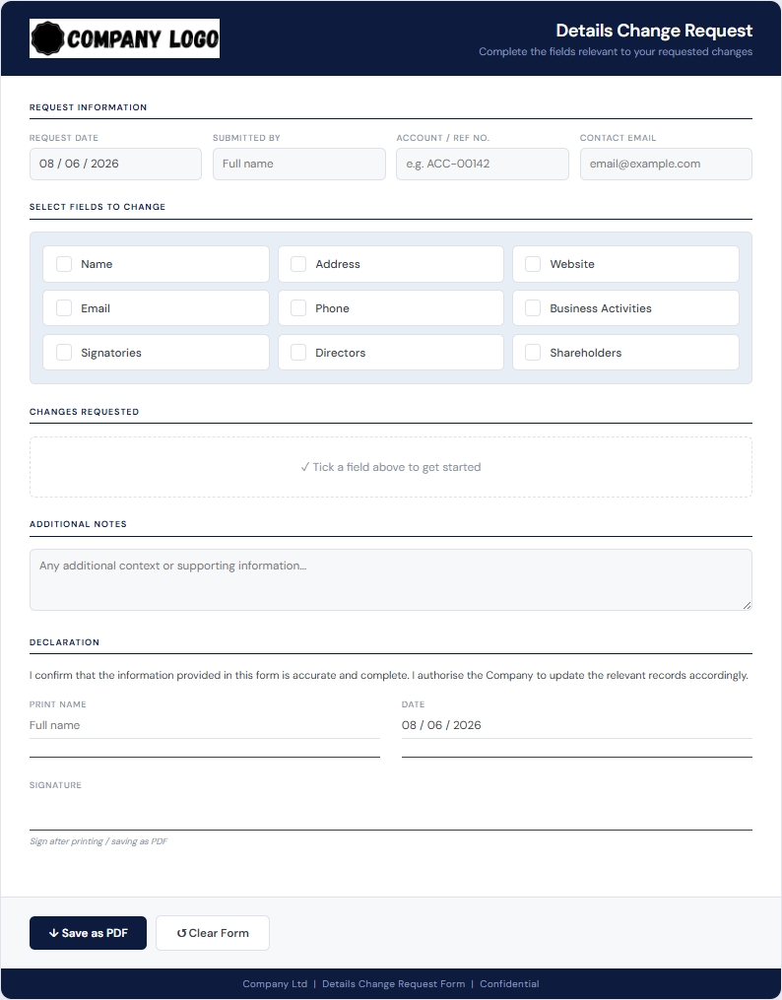

Change Request Form
A branded, standalone HTML form for submitting account details change requests. Built for financial services / KYC compliance use cases.

---
Features
Single file — no server, no dependencies, works offline in any browser
Dynamic fields — customer ticks only the fields they want to change; everything else stays hidden
Structured sections for:
Company details (Name, Address, Website, Email, Phone, Business Activities)
Directors — multiple entries, each with full KYC details
Signatories — multiple entries, each with full KYC details
Shareholders — multiple entries including % ownership bands
Address breakdown — Floor/Unit, Street Number, Street Name, City, State, Postcode, Country
Declaration block — Print Name, Date (auto-filled), and Signature line
Save as PDF — uses the browser's print dialog; no backend required
Branding — logo loaded from GitHub, footer customisable
---
Files
File	Description
`Change_Request_Form.html`	The form — open in any browser
`Company_Logo.png`	Logo displayed in the form header (400×82px PNG)
`README.md`	This file
---
How to use
As a standalone form
Download `Change_Request_Form.html`
Open it in Chrome, Edge, Safari or Firefox
Fill in the relevant fields
Click Save as PDF
Send the PDF to the relevant team
---
Customisation
What	Where
Logo	Replace `Company_Logo.png` in this folder (400×82px PNG recommended)
Footer text	Search for `Company Ltd` in the HTML and replace
Support email	Search for `support@example.com` in the HTML and replace
Ticket placeholder	Search for `TICKET_NUMBER_HERE` and replace per ticket
---
Tech
Pure HTML, CSS and vanilla JavaScript. No frameworks, no build tools, no external dependencies except the logo image hosted on GitHub.
Compatible with Chrome, Edge, Safari, Firefox. Print-to-PDF tested on Windows.
---
