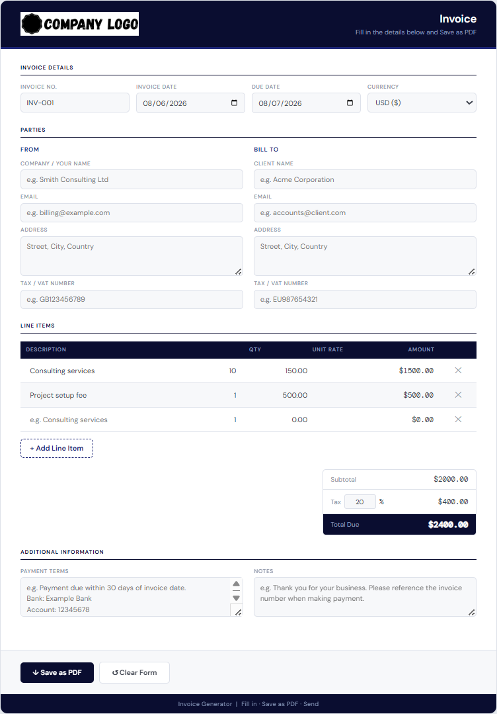

Invoice Generator
A clean, branded HTML invoice generator that runs entirely in the browser. Fill in your details, add line items, and save a professional PDF — no backend, no account, no internet connection required.

---
Overview
Built for freelancers, consultants, and small businesses that need a fast, no-fuss way to produce invoices. Everything runs client-side — the file works offline and saves as a PDF using the browser's built-in print dialog.
---
Features
Fully offline — single HTML file, no server or login required
Live calculations — quantities and rates calculate automatically as you type
Custom tax rate — type any percentage (e.g. 20%, 7.5%, 19%, 0%)
Currency selector — USD, EUR, GBP, AUD, CAD, JPY, CHF
From / Bill To sections — company name, email, address, Tax/VAT number
Invoice number, date and due date fields (due date auto-set to 30 days)
Add and remove line items dynamically
Payment terms and notes fields
Save as PDF — clean one-page print layout with all UI chrome hidden
Clear Form — resets everything back to a blank invoice
---
Files
File	Description
`Invoice_Generator.html`	The invoice generator
`Company_Logo.png`	Placeholder logo (400×82px PNG)
`preview.png`	Screenshot preview
`README.md`	This file
---
How to Use
Download `Invoice_Generator.html` and open it in Chrome, Edge, Safari or Firefox
Fill in your company details under From
Fill in client details under Bill To
Add your line items — description, quantity and rate
Set your tax rate and currency
Add payment terms and any notes
Click Save as PDF — in the print dialog set Destination to Save as PDF and click Save
---
Customisation
What	Where
Logo	Replace `Company_Logo.png` — recommended 400×82px PNG with transparent background
Colour scheme	Search `#0a0d30` (dark navy) and `#1d2577` (blue) in the HTML and replace
Default tax rate	Find `value="20"` on the tax input and change
Default currency	Find `<option value="$">` and reorder or add currencies
Footer text	Search `Invoice Generator` in the HTML and replace
---
Print Tips
For the cleanest one-page PDF in Chrome:
Click Save as PDF
In the print dialog go to More settings
Set Margins to None or Minimum
Untick Headers and footers
Click Save
---
Tech
Pure HTML, CSS and vanilla JavaScript. No frameworks, no build tools, no dependencies. All calculations are done in-browser. Compatible with Chrome, Edge, Safari and Firefox.
---
