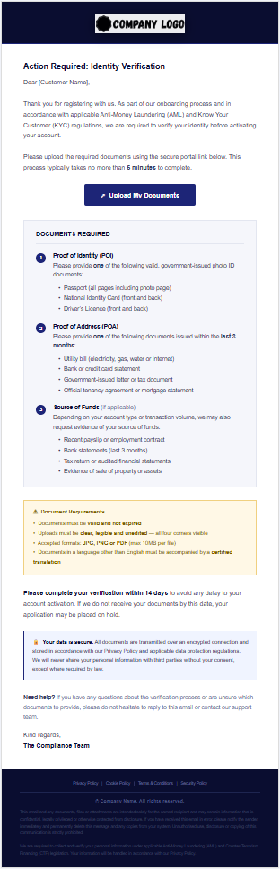

KYC Document Request Email
A professional, fully responsive HTML email template for requesting identity verification documents from new customers during onboarding. Built to industry AML/KYC standards.

---
Overview
This template is designed for financial services companies, fintechs, and any regulated business that requires identity verification as part of their onboarding process.
It covers the three standard KYC document categories and includes clear instructions, document requirements, a deadline notice, and a security reassurance block.
---
Features
Fully responsive — renders correctly on desktop and mobile email clients
Email-client safe — table-based layout, inline styles; compatible with Outlook, Gmail, Apple Mail
Three KYC document sections — Proof of Identity, Proof of Address, Source of Funds
Document requirements box — accepted formats, size limits, language requirements
14-day deadline notice — prompts customer to act promptly
Security reassurance block — encrypted connection, privacy policy reference
Neutral and reusable — no company-specific content; all placeholders clearly marked
AML/CTF compliant footer — standard legal disclaimer
---
Files
File	Description
`KYC_Document_Request_Email.html`	The email template
`Company_Logo.png`	Placeholder logo (400×82px PNG)
`preview.png`	Screenshot preview of the email
`README.md`	This file
---
Placeholders
Before using this template, replace the following:
Placeholder	Replace with
`YOUR_LOGO_URL_HERE`	URL of your hosted company logo
`javascript:void(0)` on Upload button	Your actual document portal URL
`[Customer Name]`	Customer's full name (or merge tag)
`Company Name` in footer	Your company name
Policy links in footer	Your actual policy page URLs
---
Document Sections
1. Proof of Identity (POI)
One of the following valid, government-issued photo ID documents:
Passport (all pages including photo page)
National Identity Card (front and back)
Driver's Licence (front and back)
2. Proof of Address (POA)
One of the following issued within the last 3 months:
Utility bill (electricity, gas, water or internet)
Bank or credit card statement
Government-issued letter or tax document
Official tenancy agreement or mortgage statement
3. Source of Funds (if applicable)
Recent payslip or employment contract
Bank statements (last 3 months)
Tax return or audited financial statements
Evidence of sale of property or assets
---
Document Requirements
Must be valid and not expired
Clear, legible and unedited — all four corners visible
Accepted formats: JPG, PNG or PDF (max 10MB per file)
Non-English documents require a certified translation
---
Customisation
What	Where
Colour scheme	Search `#0a0d30` (dark navy) and `#1d2577` (blue) and replace throughout
Logo	Replace `Company_Logo.png` — recommended size 400×82px PNG with transparent background
Deadline	Search `14 days` and replace
Document types	Edit the bullet point lists in each numbered section
---
Compatibility
Client	Support
Gmail (web)
Outlook
---
Tech
Pure HTML with table-based layout and inline CSS. No external stylesheets, no JavaScript, no frameworks. Follows email HTML best practices (XHTML 1.0 Transitional doctype, MSO conditional comments for Outlook).
---
